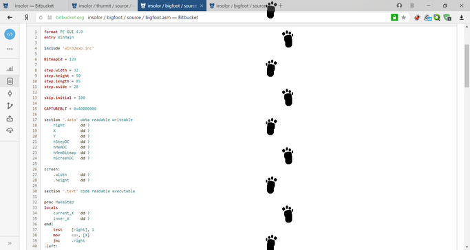

# Big Foot Screenmate

> From time to time yeti the Big Foot will cross your desktop.
> The few have seen it, and you won't. It will leave only the trace...

> Время от времени йетти, снежный человек, будет пересекать ваш рабочий стол.
> Мало кто видел йетти, не увидите и вы. Останутся только следы...

Автор оригинальной программы: **NeWMaN AleX**, ~1999 год

Реверс-инженеринг, доработка и добавление поддержки Windows 7 (и выше): **Insolor**, 2013 год

